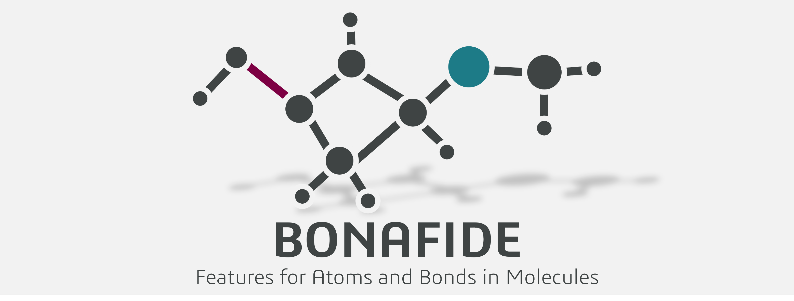

# Bond and Atom Featurizer and Descriptor Extractor (BONAFIDE)




[](https://doi.org/10.26434/chemrxiv.15001386/v1)


[](https://molecularai.github.io/atom-bond-featurizer/)

BONAFIDE is a Python-based package for calculating features for atoms and bonds in molecules by
providing a consistent API to popular featurization libraries and packages. It can calculate
descriptors based on both 2D and 3D molecular representations depending on the provided user input.
It aims to simplify the process of calculating local features for machine learning and
cheminformatics applications.

For any further details, please visit the
[documentation](https://molecularai.github.io/atom-bond-featurizer/).

## Requirements

-   Python 3.12
-   Conda (for environment management)
-   Key dependencies: alfabet, ase, dbstep, dscribe, kallisto, mendeleev, morfeus-ml, numpy, pandas,
    py3Dmol, qmdesc, rdkit, scipy
-   Optional external programs: Multiwfn, Psi4, xtb

For further details, please see the
[installation guide](https://molecularai.github.io/atom-bond-featurizer/installation.html) and the
environment `.yml` files.

## Quick Start

```python
from bonafide import AtomBondFeaturizer

f = AtomBondFeaturizer()

# Get the list of the desired feature indices (all 2D atom features from RDKit)
fdf = f.list_atom_features(origin="RDKit", dimensionality="2D")
fidx_list = fdf.index.to_list()

# Read in the molecule and calculate the features
f.read_input(input_value="O=C(O)Cc1ccccc1Nc1c(Cl)cccc1Cl", namespace="diclofenac")
f.featurize_atoms(atom_indices="all", feature_indices=fidx_list)

# Retrieve results as a DataFrame
f.return_atom_features()
```

For more details and examples, see the [examples](examples/) folder and the
[documentation](https://molecularai.github.io/atom-bond-featurizer/features.html).

## Reference

Please refer to our [preprint](https://chemrxiv.org/doi/full/10.26434/chemrxiv.15001386/v1).
