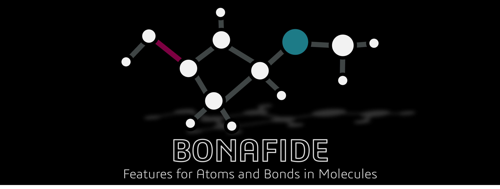

.. image:: _static/doc_image_light.png
   :align: center
   :width: 90%
   :class: only-light

This is the documentation of the **BOnd aNd Atom FeaturIzer and Descriptor Extractor** (BONAFIDE)!

**Latest version:** |release|

BONAFIDE is a Python-based package for calculating :doc:`features <feature_list>` for atoms and
bonds in molecules by providing a consistent API to popular featurization libraries and packages. It
can calculate descriptors based on both 2D and 3D molecular representations depending on the
provided :doc:`user input <input>`. It aims to simplify the process of calculating local features
for machine learning and cheminformatics applications.

The **source code of BONAFIDE** is publicly available on 
`GitHub <https://github.com/MolecularAI/atom-bond-featurizer>`_.

#########
 Preview
#########

Get all 2D RDKit features for all atoms in a molecule starting from a SMILES string.

.. code:: python

   >>> from bonafide import AtomBondFeaturizer
   >>> f = AtomBondFeaturizer()
   >>> # Get the list of the desired feature indices
   >>> fdf = f.list_atom_features(origin="RDKit", dimensionality="2D")
   >>> fidx_list = fdf.index.to_list()
   >>> print(len(fidx_list))
   45
   >>> # Read in the molecule and calculate the features
   >>> f.read_input("O=C(O)Cc1ccccc1Nc1c(Cl)cccc1Cl", "diclofenac")
   >>> f.featurize_atoms(atom_indices="all", feature_indices=fidx_list)
   >>> # Get the results
   >>> f.return_atom_features()
   >>> ...

##############
 Dependencies
##############

BONAFIDE provides a unified interface to the following packages. Further details on the dependencies
can be found :doc:`here <dependencies>`.

-  ALFABET
-  DBSTEP
-  DScribe
-  kallisto
-  mendeleev
-  MORFEUS
-  Multiwfn
-  Psi4
-  qmdesc
-  RDKit
-  xtb

#########
 License
#########

BONAFIDE is released under the `Apache License, Version 2.0
<https://www.apache.org/licenses/LICENSE-2.0>`_.

.. toctree::
   :maxdepth: 3
   :caption: Getting started
   :hidden:

   installation
   notes
   feature_list
   dependencies

.. toctree::
   :maxdepth: 3
   :caption: General functionality
   :hidden:

   config_settings
   input
   bonds
   electronic_structure

.. toctree::
   :maxdepth: 3
   :caption: Feature calculation
   :hidden:

   features
   output
   custom
   external_environment
   feature_notes

.. toctree::
   :maxdepth: 3
   :caption: Source
   :hidden:

   GitHub <https://github.com/MolecularAI/atom-bond-featurizer>

.. toctree::
   :maxdepth: 3
   :caption: User API
   :hidden:

   modules_user

.. toctree::
   :maxdepth: 3
   :caption: Full API
   :hidden:

   modules
