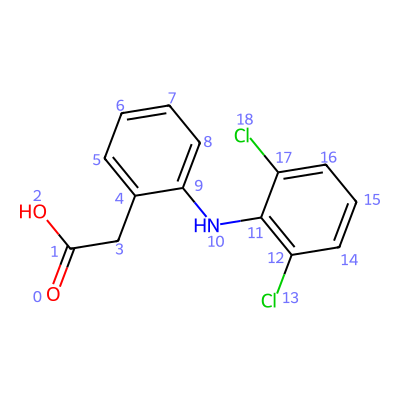

############
 User input
############

BONAFIDE can read **four different types of input** through its :meth:`read_input()
<bonafide.bonafide.AtomBondFeaturizer.read_input>` method.

-  **SMILES strings**
-  **XYZ** files in XMOL format (``*.xyz``)
-  Structured data files (**SDF**, ``*.sdf``)
-  **Molecule objects** (from RDKit)

SMILES strings can be used to input **2-dimensional** graph representations of molecules, while XYZ
and SD files should be used to represent **3-dimensional** molecular structures. SD files provide
the opportunity to add information on the connectivity of the atoms within the molecule, which is
read and processed by BONAFIDE. For maximum flexibility, also RDKit molecule objects can be directly
read in - either with 2D or 3D molecular information (that is, with or without conformers). RDKit
molecule objects with only 2D coordinate information (2D conformers) are not supported.

XYZ and SD files as well as RDKit molecule objects can contain **multiple conformers** (of the same
molecule) in a single file/object, and BONAFIDE will process the entire ensemble.

*************************
 Reading a SMILES string
*************************

.. code:: python

   >>> from bonafide import AtomBondFeaturizer
   >>> f = AtomBondFeaturizer()
   >>> f.read_input("O=C(O)Cc1ccccc1Nc1c(Cl)cccc1Cl", "diclofenac", output_directory="results/diclo_output")

****************
 Reading a file
****************

For reading an XYZ or SD file, the ``input_format`` parameter must be set to "file". Multiple
possible conformers are automatically handled during processing.

It is also possible to read the (precomputed) **energy** of the individual conformers for
calculating Boltzmann-weighted and related features. This is possible by specifying the energy (in
kcal/mol, kJ/mol, or Hartree) in the second line of each conformer block (in case of an XYZ file) or
by specifying a property denoted ``energy`` (in case of an SD file). By default, the ``read_energy``
parameter is set to ``False`` and must be set to ``True`` to read the energy data from the file.
Energy data must always be specified as strings containing the value and the respective unit
separated by a space, for example, ``"-10.5 kcal/mol"`` or ``"-1254.21548 Eh"``.

It is also possible to **prune the conformer ensemble** based on relative energies by setting the
``prune_by_energy`` parameter.

.. code:: python

   >>> from bonafide import AtomBondFeaturizer
   >>> f = AtomBondFeaturizer()
   >>> f.read_input("diclo.xyz", "diclofenac", input_format="file", read_energy=True)

Alternatively, it is possible to add conformer energies with the :meth:`attach_energy()
<bonafide.bonafide.AtomBondFeaturizer.attach_energy>` method after reading the input file (see
:doc:`electronic_structure`).

**********************************
 Reading an RDKit molecule object
**********************************

For reading an RDKit molecule object, the ``input_format`` parameter must be set to "mol_object".
Only one molecule object can be processed, and multiple conformers of a molecule should be
associated with the same molecule object. As for files, it is possible to read-in **conformer
energies** by setting the ``read_energy`` parameter to ``True``. In this case, the energy data must
be specified as a property (denoted ``energy``) of the respective conformer. The same energy data
formatting requirements apply as for files (see above).

.. code:: python

   >>> from rdkit import Chem
   >>> from rdkit.Chem import AllChem
   >>> from bonafide import AtomBondFeaturizer
   >>> # Define example mol object with 5 conformers
   >>> mol = Chem.MolFromSmiles("O=C(O)Cc1ccccc1Nc1c(Cl)cccc1Cl")
   >>> mol = Chem.AddHs(mol)
   >>> AllChem.EmbedMultipleConfs(mol, numConfs=5)
   >>> # Execute BONAFIDE
   >>> f = AtomBondFeaturizer()
   >>> f.read_input(mol, "diclofenac", input_format="mol_object")

*********************
 After input reading
*********************

After a SMILES or file input was read, it is possible to **visualize the molecule** through the
:meth:`show_molecule() <bonafide.bonafide.AtomBondFeaturizer.show_molecule>` method. This will
render the molecule in a Jupyter notebook, by default with the indices of the atoms displayed. This
can be changed by setting ``index_type="bond"`` (for bond indices) or ``index_type=None`` (for no
indices). For 3D structures, it is also possible to look at the molecule and the entire conformer
ensemble, respectively, in an interactive 3D viewer by setting ``in_3D=True``.

.. code:: python

   >>> from bonafide import AtomBondFeaturizer
   >>> f = AtomBondFeaturizer()
   >>> f.read_input("O=C(O)Cc1ccccc1Nc1c(Cl)cccc1Cl", "diclofenac")
   >>> f.show_molecule()

It is also possible to inspect the ``mol_vault`` attribute of the featurizer object (see the
:class:`MolVault <bonafide.utils.molecule_vault.MolVault>` class for further details). It collects
**all relevant information about the molecule** (and its potential conformers).

.. code:: python

   >>> from bonafide import AtomBondFeaturizer
   >>> f = AtomBondFeaturizer()
   >>> f.read_input("O=C(O)Cc1ccccc1Nc1c(Cl)cccc1Cl", "diclofenac")
   >>> f.mol_vault
   ...
